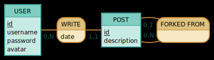

# Database

Here's a quick overview of the database system we use for the project.

## Software

We use MariaDB. Being what is promoted by the school we didn't have much of a choice. It's a good system, though.

## Tables

We have currently two tables, `users` and `posts`. Here's the corresponding schema:

<!-- https://www.mocodo.net/?mcd=eNoLDXYNslLITNFRKC1OLcpLzE3VUShILC4uzy8CiiWWJZYkFnGFB3mGuOooGBoqBPgHh-goGPgphIL1pSSWpHKBxCBGpKQWJxdlFpRk5udxufkHebu6KLgF-fsCNSDpBDG4AKfyIzQ= -->

### Users

| Field    | Type          | Description                                                                                 |
| -------- | ------------- | ------------------------------------------------------------------------------------------- |
| id       | `UUID`        | A unique identifier for the user. Generated by the server on sign up.                       |
| username | `VARCHAR(20)` | The username of the user. Has a maximum length of 20 characters.                            |
| password | `VARCHAR(60)` | The password of the user. Encrypted with bcrypt.                                            |
| avatar   | `LONGBLOB`    | The avatar of the user. Can be null (and is by default) if the user doesn't have an avatar. |

### Posts

| Field       | Type       | Description                                                                    |
| ----------- | ---------- | ------------------------------------------------------------------------------ |
| id          | `UUID`     | A unique identifier for the post. Generated by the server on post creation.    |
| author      | `UUID`     | The unique identifier of the user that created the post.                       |
| date        | `DATETIME` | The date and time the post was created.                                        |
| forked_from | `UUID`     | Identifier of the post this post was forked from. Is null if it is not a fork. |
| description | `TEXT`     | The description of the post.                                                   |

## Setup

In order to set up the database, you first need to set the proper environment variables. They can be modified in the `.htaccess` file. You must set a secure `ADMIN_KEY`. This key is required everytime you want to make a change to the database. Also make sure to set the host, username, password and database name. If there's no password (in the case of a local server), you can comment the line using a `#`.

When this is done, you can open `/admin/database/setup`, enter the admin key and click on `Setup database`. This will create the database and the tables.

> [!WARNING]  
> If there's already a database with the same name, it will be dropped and replaced by a new one. Make sure to backup your data if needed before doing this.
